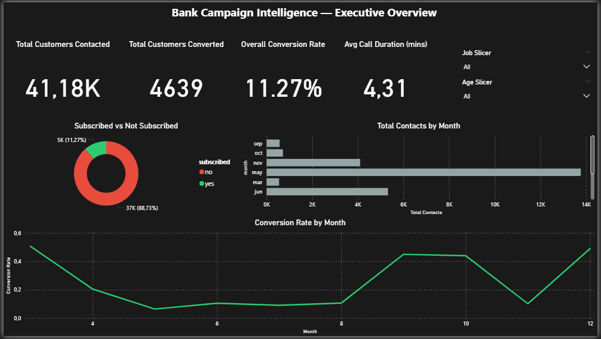
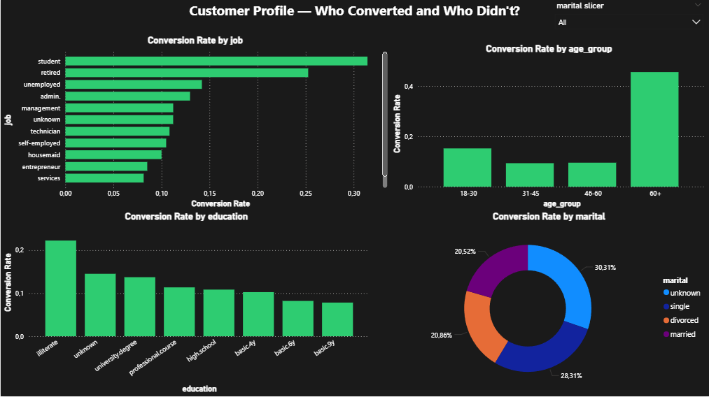
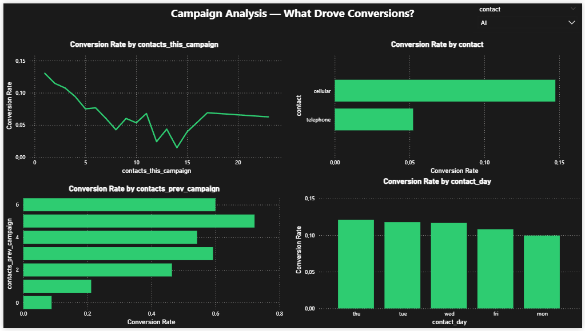
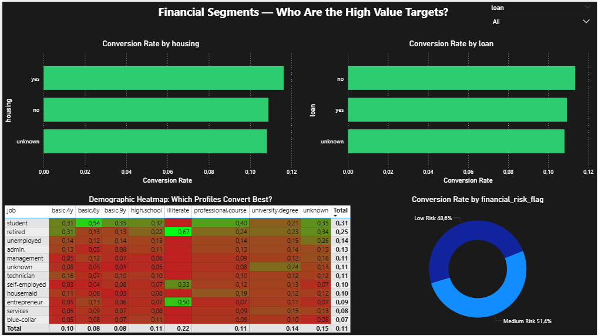

# Bank Campaign Intelligence Dashboard

A business analytics case study that turns a Portuguese bank's telemarketing data into a four-page Power BI decision dashboard.



## Business question

Which customer segments and campaign patterns are associated with higher term-deposit subscription rates, and where does repeated outreach show diminishing returns?

## Project at a glance

| Item | Result |
|---|---|
| Source data | UCI Bank Marketing dataset |
| Raw records | 41,188 |
| Analysis-ready records | 41,176 after removing 12 duplicates |
| Target | Term-deposit subscription (`yes` / `no`) |
| Analysis | Python, pandas, NumPy |
| Reporting | Four-page Power BI dashboard |
| Status | Completed portfolio case study |

## Workflow

1. Loaded and profiled the raw campaign data.
2. Checked schema, duplicates, missing values, and categorical quality.
3. Removed 12 duplicate rows and retained explicit `unknown` categories rather than silently dropping them.
4. Created analysis-ready fields and compared conversion across customer, contact, and campaign dimensions.
5. Built a four-page Power BI dashboard for executive, customer, campaign, and financial views.
6. Converted the findings into testable campaign recommendations while documenting analytical limits.

## Verified findings

- **Overall conversion:** 4,639 of 41,176 customers subscribed, an observed rate of **11.27%**.
- **High-converting segments:** students converted at **31.43%** (n=875) and retired customers at **25.26%** (n=1,718), both more than twice the portfolio average.
- **Diminishing returns from repeated contact:** conversion declined from **13.04% on the first attempt** to **7.50% on the fifth** and **4.25% on the eighth**. This supports testing contact-frequency limits; it does not mean conversion becomes zero after five attempts.
- **Contact channel:** cellular contacts showed **14.74%** observed conversion versus **5.23%** for telephone contacts. This is an association, not proof that channel alone caused the difference.
- **Previous campaign history:** customers with a previously successful outcome showed substantially higher conversion, making prior engagement a useful segmentation signal.

## Dashboard

| Executive overview | Customer profile |
|---|---|
|  |  |

| Campaign analysis | Financial segmentation |
|---|---|
|  |  |

The public repository contains the complete analysis notebook and exported dashboard screenshots. The Power BI `.pbix` file is not currently included.

## Decision implications

- Prioritize test campaigns for high-performing segments and customers with positive prior engagement.
- Compare contact strategies by segment instead of applying one rule to every customer.
- Test a practical contact-frequency cap against incremental conversions and campaign cost.
- Treat the dashboard as decision support; validate recommendations with controlled experiments before operational rollout.

## Data quality and analytical boundaries

- The dataset is historical, so the results describe this campaign and should not be treated as a current market forecast.
- `unknown` is a source-system category, not a null value; it was preserved so the analysis remains auditable.
- Call duration is only known after a call finishes. It may explain outcomes retrospectively but must not be used as a pre-contact targeting feature.
- Findings are descriptive associations. This project does not claim causal lift, production deployment, or measured ROI.

## Repository contents

```text
.
├── Case_Study_bank_campaign_cleaning.ipynb
├── assets/
│   ├── dashboard-overview.png
│   ├── customer-profile.png
│   ├── campaign-analysis.png
│   └── financial-segmentation.png
└── README.md
```

## Reproduce the analysis

1. Download `bank-additional-full.csv` from the [UCI Bank Marketing dataset](https://archive.ics.uci.edu/dataset/222/bank+marketing).
2. Open the notebook in Google Colab or Jupyter.
3. Make the CSV available at the path used in the notebook, or update the load path.
4. Run the cells from top to bottom.

## Skills demonstrated

Python · pandas · NumPy · data cleaning · exploratory analysis · KPI design · customer segmentation · campaign analytics · Power BI · business communication

## Author

**Vansh Dhiman**  
Digital Business & Data Science student, Hamburg  
[LinkedIn](https://www.linkedin.com/in/vansh-dhiman-data) · [GitHub](https://github.com/vanshdhiman090)
